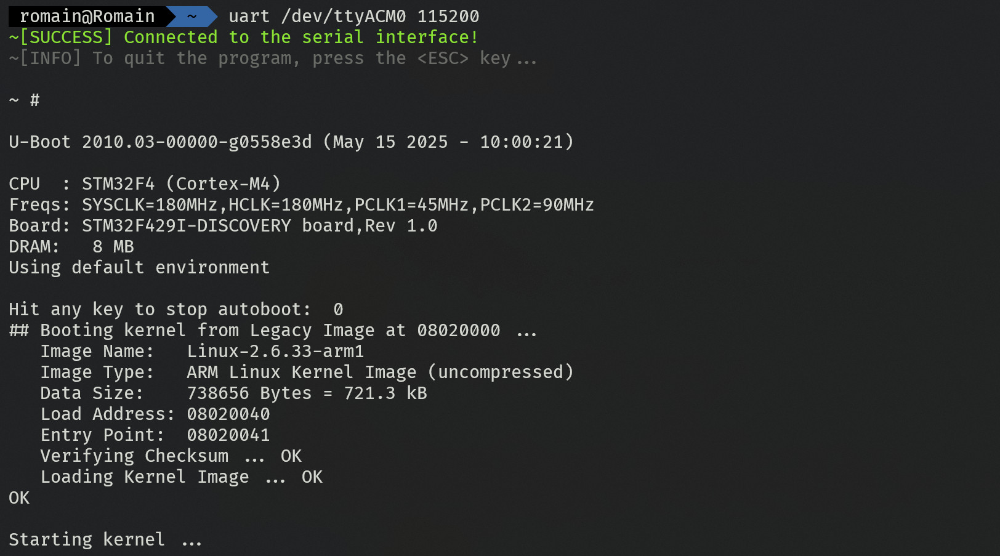

# linux_uart_interface

This program is a recreation of picocom. It allows you to connect to a tty serial interface. 

<p align="center">
    
    <br />
    <i align="center">Example of the program running.</i>
</p>

## Usage
To connect to a serial interface, you'll need to use this command. 
```bash
uart <interface> <baud_speed>
```
For example, if you want to connect to `/dev/ttyS0` at a speed of `38400` baud, you'll use:
```bash
uart /dev/ttyS0 38400
```

> **NOTE:**  If the baud speed is not recognized, it will be automatically set to 115200. 

To escape the program, just press the `ESC` key on your keyboard. 

## Licence
- romainflcht


